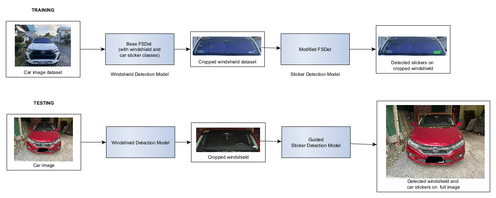
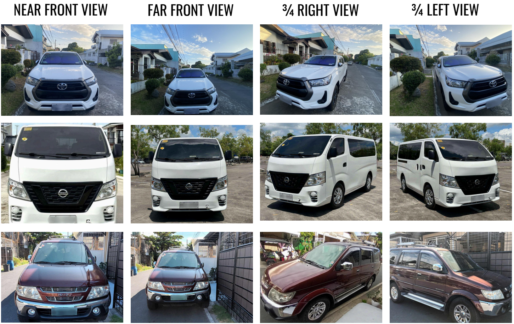
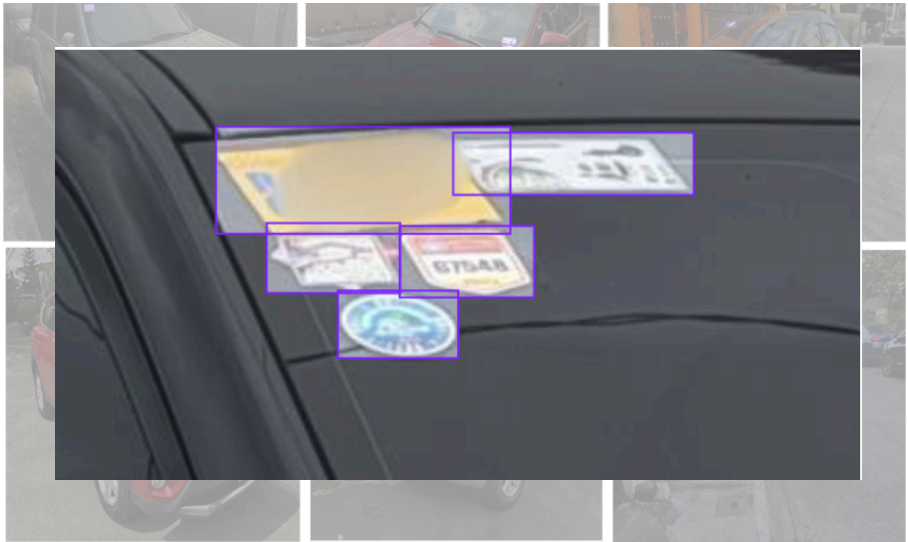
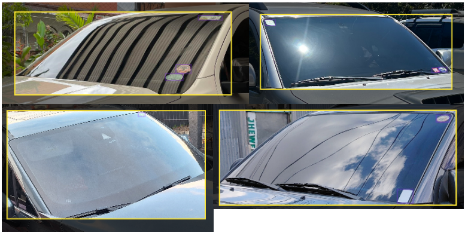
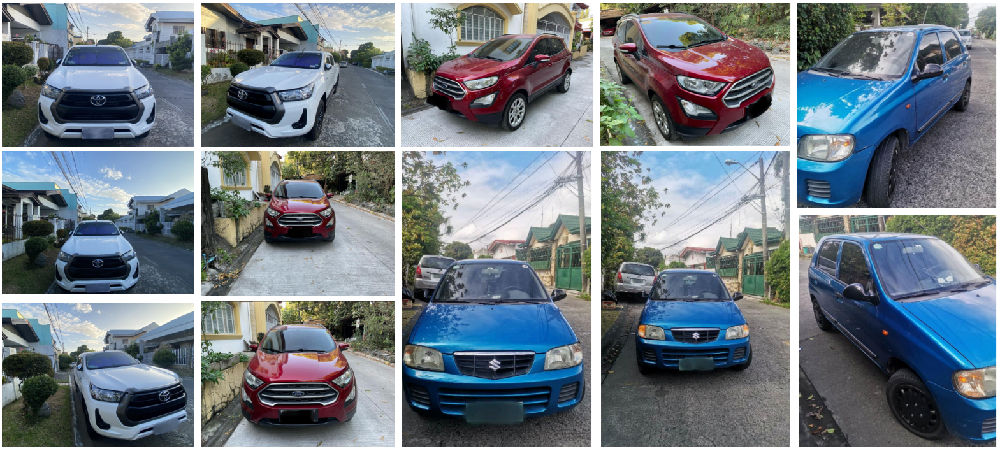
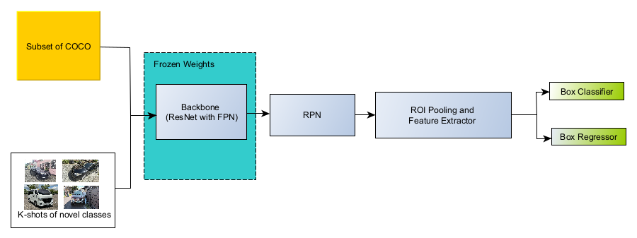
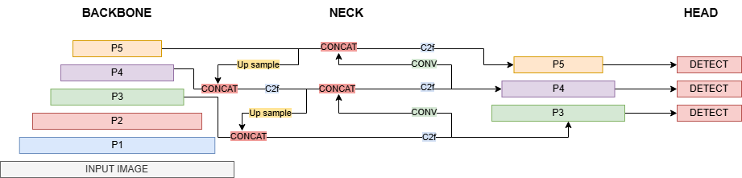

# Few-Shot Car Sticker Detection
This repository contains the code used in the study **Few-Shot Car Sticker Detection.** This study focuses on detecting tiny car stickers on images of cars with few annotated examples. A car sticker dataset was created through crowsourcing and this dataset serves as the training and testing data of this project.

A two stage guided detection pipeline called **WiSDet (Windshield-to-Sticker Detection)**, is proposed for detecting car stickers on windshields. This pipeline first detects windshields then focuses sticker detection within the region.

The pipeline works as follows:

1. A **guide detector** finds the windshield on the full image.
2. The image is cropped to the windshield region.  
3. A **sticker detector** runs on the cropped images to detect tiny stickers.  
4. Sticker boxes from crops are **remapped** back to original image coordinates.  
5. Performance is evaluated with [pycocotools](https://pypi.org/project/pycocotools/) **COCOeval**.

---
## Implementations
The study has two implementations of WiSDet, one using [FsDet](https://github.com/ucbdrive/few-shot-object-detection) and another using Ultralytics [YOLOv8](https://docs.ultralytics.com/models/yolov8/).

Each model family has its own **`README`** in the repository:
1. [FsDet](FsDet/README.md)
2. [YOLOv8](YOLOv8/README.md)   
*These contain links to their trained weights, detailed setup, and usage guide.*
---
## The Dataset
A `Car Sticker Dataset` was made through crowdsourcing for this study. This serves as the data for training and testing the models. The dataset composes of car images with their windshields visible. There are four different views for each car.
1. Near Front View
2. Far Front View
3. 3/4 Right View
4. 3/4 Left View

To illustrate, the image below shows samples of each viewpoint.

Both windshields and car stickers are annotated with bounding boxes. All visible windshields and all visible stickers in every image are labeled. Below are sample annotations of the car stickers and windshields.

  
  

There are **312 images**, representing **78 unique cars**, with **1134 annotated stickers** and **347 annotated windshields** in total.

The dataset is organized into several K-shot configurations to support few shot experiments. Each configuration uses the same testing split and varies only in how many sticker instances are available during training.

| Dataset | Train Images | Train Windshields | Train Stickers | Test Images | Test Windshields | Test Stickers |
| ------- | ------------ | ----------------- | -------------- | ----------- | ---------------- | ------------- |
| 31-Shot | 12           | 12                | 31             | 300         | 335              | 1103          |
| 10-Shot | 2            | 3                 | 10             | 310         | 344              | 1124          |
| 5-Shot  | 1            | 1                 | 5              | 311         | 346              | 1129          |
| 2-Shot  | 1            | 1                 | 2              | 311         | 346              | 1132          |

Below are more samples of the dataset.

*These images are from the training data of the 31-shot dataset.*

---
## FsDet Overview

- The model is a standard two-stage object detector, Faster-RCNN with a ResNet-101 FPN backbone. During few-shot fine tuning, the model is trained on target novel classes (i.e., windshield, sticker).
---
## YOLOv8 Overview

- **Backbone**  
  The backbone extracts multi scale feature maps from the input image.  
  It uses convolutional blocks with skip connections (C2f blocks in Ultralytics YOLOv8) to capture both local detail and high level semantics.

- **Neck**  
  The neck builds a feature pyramid by repeatedly **upsampling** and **concatenating** feature maps from different stages. 
  This combines low level spatial detail from shallow layers with rich semantic information from deeper layers, which is important for tiny sticker targets.

- **Detection Head**  
  The head predicts bounding boxes and class scores at three scales (P3, P4, P5).  
  These multi scale predictions allow the model to detect objects of different sizes, with the finest scale focused on small objects like windshield stickers.

In this work we fine tuned **YOLOv8n** and **YOLOv8l**.  
Both share the same architecture. The *n* model is narrow and shallow, which is faster but less accurate, while the *l* model is wider and deeper, which improves accuracy at a higher computational cost.

### Training configuration

All YOLOv8 models used the same fine tuning configuration, except for weight decay which differs by model size.  
Other settings follow the Ultralytics YOLOv8 defaults.

| Hyperparameter | Value                               |
| ------------- | ------------------------------------ |
| Learning rate | 0.001                                |
| Optimizer     | SGD                                  |
| Freeze        | 10 backbone layers at the start      |
| Momentum      | 0.95                                 |
| Weight decay  | 0.00001 for `YOLOv8n`; 0.0005 for `YOLOv8l` |
| LR scheduler  | MultiStepLR                          |
- The **freeze** setting keeps the first 10 backbone layers fixed at the start of training.  
  This preserves generic features from pre training and is helpful in the few shot setup.  
- **Momentum** and **weight decay** follow common YOLO practices, with slightly stronger regularization for the larger *l* model.  
- The **MultiStepLR** scheduler reduces the learning rate at predefined epochs, which stabilizes training and improves final AP.
*For a detailed setup and usage guide, refer to the [YOLOv8 README](YOLOv8/README.md) file.*
---
## Summary of Results
### Initial Models AP@50 Performance
| Model            |    31 shot |    10 shot |     5 shot |     2 shot |   Weights   |
| ---------------- | ---------: | ---------: | ---------: | ---------: |  ---------: |
| YOLOv8n          |     0.2524 |     0.1670 |     0.1551 |     0.1539 |  [GDrive](https://drive.google.com/drive/folders/1zdaSyYglIue5reBu41nDx_9-rQf1p3Bv?usp=sharing)   |
| YOLOv8l          | **0.4330** | **0.3839** | **0.3229** | **0.2874** |  [GDrive](https://drive.google.com/drive/folders/1eT3_b71ahGVj2RikJOmkUmamDl6mlNxT?usp=sharing)     |
| FsDet            |     0.2892 |     0.1407 |     0.1839 |     0.1773 |  [GDrive](https://drive.google.com/drive/folders/14EyJRY1J5UsKwa6_P-0hyavH3BSIRO5t?usp=sharing)     |

- The larger `YOLOv8l` model is the strongest baseline across all shot settings.  
- `FsDet` is the middle ground when it comes to performance but has a drop on 10-shot.  
- `YOLOv8n` has the lowest AP but is the lightest model, useful as a speed oriented baseline.

### Models with WiSDet AP@50 Performance
| Model            |    31 shot |    10 shot |     5 shot |     2 shot | Weights |
| ---------------- | ---------: | ---------: | ---------: | ---------: | ---------: |
| YOLOv8n + WiSDet |     0.4014 |     0.3350 |     0.3108 |     0.3147 | [GDrive](https://drive.google.com/drive/folders/1Y6ThiwV1EfTs1aBYQnqEIIXI0De6lbSK?usp=sharing) |
| YOLOv8l + WiSDet |     0.4937 | **0.4200** |     0.3397 |     0.3049 | [GDrive](https://drive.google.com/drive/folders/1L58pdhWYxqOMRiwVl091RQnSh4R_Vo-I?usp=sharing)  |
| FsDet + WiSDet   | **0.5050** |     0.3180 | **0.3400** | **0.3320** | [GDrive](https://drive.google.com/drive/folders/1jvblA6Q2hafO_orcLZnCYj0F2jpHAd0s?usp=sharing) |

- Adding WiSDet gives clear AP gains for every backbone and shot count.  
- FsDet + WiSDet reaches the highest AP at 31, 5, and 2 shot, while YOLOv8l + WiSDet is best at 10 shot.  
- The gains are largest in the few shot settings, which shows that guiding the detector with the windshield region helps when data is scarce.

### Windshield Detector AP@50 Performance
| Model   | AP@50 (windshield) | Weights |
| ------- | -----------------: | -------: | 
| YOLOv8n |             0.8061 | [GDrive](https://drive.google.com/drive/folders/1Y6ThiwV1EfTs1aBYQnqEIIXI0De6lbSK?usp=sharing)  |
| YOLOv8l |             0.8770 | [GDrive](https://drive.google.com/drive/folders/1L58pdhWYxqOMRiwVl091RQnSh4R_Vo-I?usp=sharing) |
| FsDet   |             0.9010 | [GDrive](https://drive.google.com/drive/folders/1pPbuBOHWn4XN473DeUA5Q0cwrGTXy4ix?usp=sharing) |
- Guide detectors were trained on the 31-shot dataset.
- All guide detectors exceed 0.80 AP@50 on windshields, so the crop regions are reliable.  
- FsDet gives the most accurate windshield boxes, followed closely by YOLOv8l.  
- These strong windshield results support WiSDet, since sticker detection depends on good crops.
